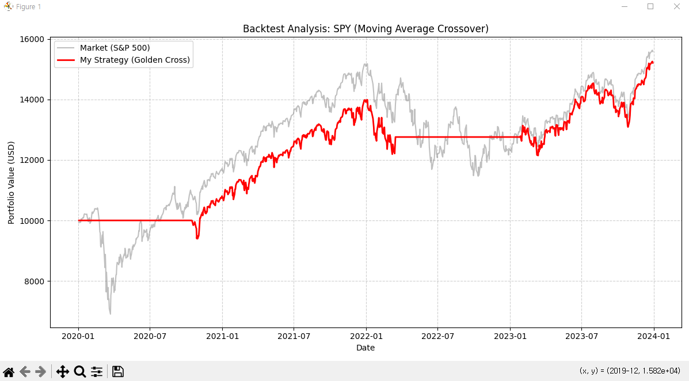

# SimpleQuant: Educational Backtesting Framework 

### Overview
**SimpleQuant** is a lightweight, event-driven backtesting engine designed to help high school students and novice investors validate their trading strategies before risking real capital.

Motivated by the principle of **"Process over Outcome,"** this project aims to bridge the gap between theoretical finance knowledge (like MITx MicroMasters concepts) and practical application. It allows users to simulate algorithmic trading strategies using historical data with a focus on risk management.

### Key Features
* **Modular Design:** Separates Data, Strategy, and Execution logic for clarity.
* **Risk Management:** Visualizes how strategies perform during market downturns (e.g., COVID-19 crash).
* **Performance Visualization:** Automatically generates equity curves comparing the Strategy vs. S&P 500 (Benchmark).

### Sample Result
Below is a backtest result of a **Golden Cross Strategy (50-day MA vs 200-day MA)** on SPY ETF (2020-2024).
Note how the strategy (Red) minimizes drawdown during high-volatility periods compared to the market (Gray).



### Technical Stack
* **Language:** Python 3.10+
* **Libraries:** `pandas` (Data Manipulation), `yfinance` (Market Data API), `matplotlib` (Visualization)

### How to Run
1. Clone this repository.
2. Install dependencies:
   ```bash
   pip install pandas yfinance matplotlib
